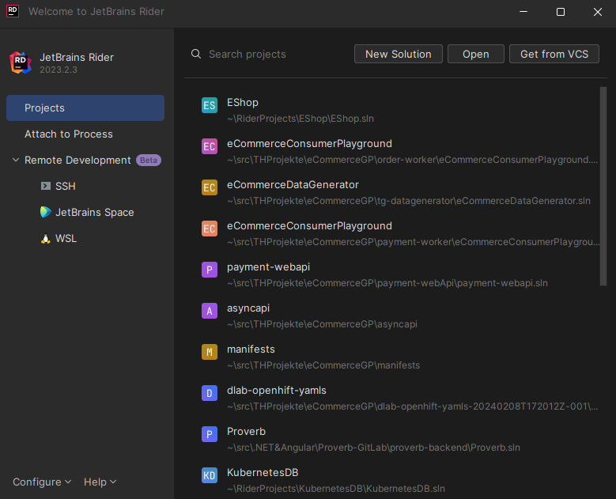
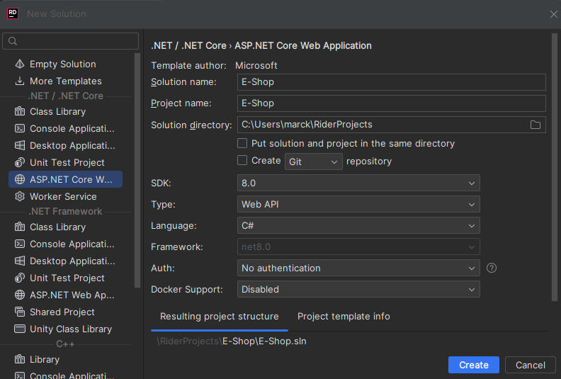
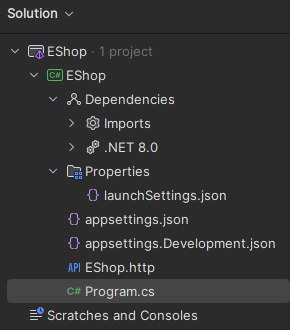
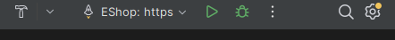
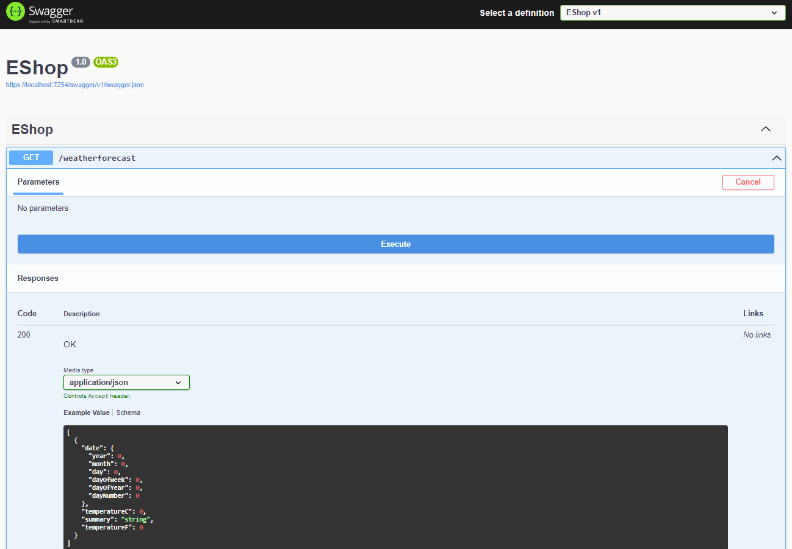
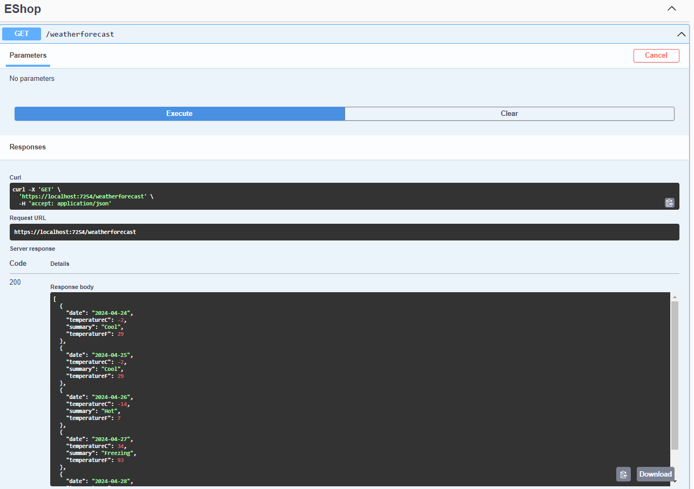

# Projekt erstellen

In dieser Dokumentation wird die IDE Rider verwendet. In anderen IDEs verläuft der Prozess ähnlich.

## Übersicht

In der Abbildung sind alle vorhandenen Projekte zu sehen, die in Rider eingebunden sind. Jedes dieser Projekte kann mit
einem Klick geöffnet werden. Im Suchfeld kann nach einem bestimmten Projekt gesucht werden. Über die rechts daneben
befindlichen Buttons lässt sich eine neue Solution erstellen oder ein anderes lokales Projekt öffnen.



In diesem Fall soll ein neues Projekt angelegt werden.

## Verschiedene Projektvorlagen

Auf der linken Seite der Abbildung sind die verschiedenen Vorlagen für ein Projekt zu sehen. Zu den bekanntesten
Vorlagen zählen bspw. die Konsolenanwendung, die ASP.NET Core Web Application, die Klassen Bibliothek und das Template
für Unit-Tests.

- Das Template für eine **Console Application** erstellt ein Projekt, welches direkt vorkonfiguriert ist und beim
  Starten eine Konsolenanwendung ausführt.
- Das Template für eine WebAnwendung hingegen erstellt ein Projekt mit der Struktur für eine Backendanwendung als
  RestAPI.
- Die Klassenbibliothek kann in verschiedenen Solutions hinzugefügt werden, in welcher oft Business Logik abgebildet
  wird.
- Das Template für Unit-Tests erstellt ein Projekt mit der Ordnerstruktur für, wie der Name schon sagt, Unittests.

Darüber hinaus gibt es noch einige andere Vorlagen, auf die nicht weiter eingegangen wird.



In diesem Beispiel wird eine Webapplikation erstellt.

Dazu können auf der rechten Seite weitere Konfigurationen vorgenommen werden.

- Für die Solution und für das Projekt kann ein entsprechender Name vergeben werden. Hier wird *EShop* gewählt.
- Außerdem kann ein Pfad ausgewählt werden, wo das Projekt lokal auf dem Rechner abgelegt werden soll.
- Als SDK verwenden wir *.NET 8*, dies entspricht der aktuellsten Version von Microsoft .NET.
- Als Sprache wird C# ausgewählt.
- Für dieses Projekt wird erstmal keine Authentifizierung und Docker Unterstützung benötigt.

Danach kann auf *Create* geklickt werden, um das konfigurierte Projekt zu erstellen.

## Ordnerstruktur

Jede Projektvorlage beinhaltet eine bestimmte Ordnerstruktur. In diesem Abschnitt wird die Ordnerstruktur der
Webanwendung *EShop* näher erläutert.



Die oberste Ebene ist die Solution, direkt gefolgt von dem Projekt. In dem Projekt existieren sechs Verzeichnisse /
Dateien.

### Dependencies

In dem Verzeichnis *Dependencies* ist festgelegt, mit welcher DotNET-Version die Applikation ausgeführt wird und welche
externen Pakete in das Projekt geladen werden.

### Properties

In *Properties* ist eine Datei enthalten, *LaunchSettings.json*.

```json
{
  "https": {
    "commandName": "Project",
    "dotnetRunMessages": true,
    "launchBrowser": true,
    "launchUrl": "swagger",
    "applicationUrl": "https://localhost:7254;http://localhost:5130",
    "environmentVariables": {
      "ASPNETCORE_ENVIRONMENT": "Development"
    }
  }
}
```

In dieser werden verschiedene Profile angelegt, mit welcher die Anwendung gestartet werden kann. Dort kann bspw. die URL
gefunden werden, aber auch, dass die Anwendung im Developer-Modus gestartet wird.

### Appsettings

Die Anwendungskonfiguration in ASP.NET Core erfolgt mithilfe eines Konfigurationsanbieters. Konfigurationsanbieter lesen
Konfigurationsdaten aus Schlüssel-Wert-Paaren bspw. unter Verwendung einer Einstellungsdatei (*appsettings.json*).

``` json
{
  "Logging": {
    "LogLevel": {
      "Default": "Information",
      "Microsoft.AspNetCore": "Warning"
    }
  },
  "AllowedHosts": "*"
}
````

In dem obigen Codeauszug sind verschiedene Schlüssel-Wert-Paare zu sehen, welche die Anwendung entsprechend
konfigurieren kann.

Es sind zwei appsettings-Dateinen zu sehen: *appsettings.json* und *appsettings.Development.json*. Der Unterschied
zwischen diesen besteht darin, dass die Appsettings-Datein mit der Endung *.Development* verwendet wird, wenn in dem
Profil (vorheriges Kapitel) als Umgebungsvariable "Development" mitgegeben wurde. Wenn die Anwendung im einer
produktiven Umgebung ausgeführt wird, wird die andere appsettings verwendet.

### EShop.http

In der *EShop.http*-Datei werden belibiege Entpunkte definiert. Beispielsweise ein GET-Endpunkt für eine
Wettervorhersage:

```` js
@EShop_HostAddress = http://localhost:5130

GET {{EShop_HostAddress}}/weatherforecast/
Accept: application/json

###
````

### Programm.cs

Die *Programm.cs*-Datei enthält den Programmcode für die Anwendung. Außerdem ist sie der Codeeinstiegspunkt für die
Anwendung.
In dieser werden die entsprechen Konfigurationen aus den vorherigen Dateien geladen, die Programmlogik ausgeführt und
schlussendlich dem Nutzer das Ergebnis angezeigt.

## Anwendung starten

Um die Anwendung zu starten, muss in der oberen Ecke der Anwendung ein Profil ausgewählt werden. In diesem Fall nutzen
wir das *https* Profil.
Danach muss auf das grüne Startsymbol geklickt werden und darauf folgend sollte sich der Browser öffenen.



Im Browser sollte sich eine Swagger-Seite öffnen, welche der nachfolgenden Abbildung ähnlich aussehen sollte.



Hier kann eine Anfrage an den Endpunkt */weatherforecast* gesendet werden. Die in der Ausgabe zusehenden Daten über die
Wetterbedingungen sollten zurückgegeben werden.

