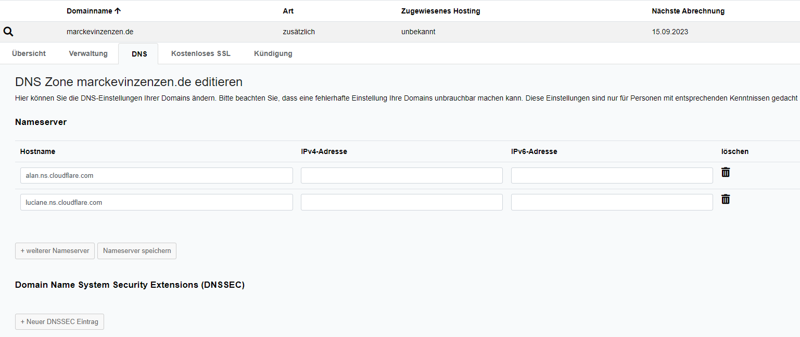
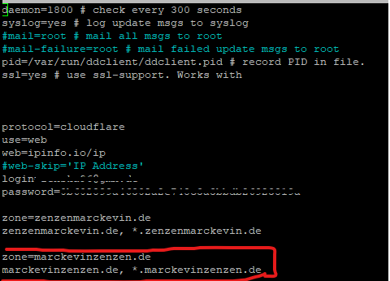
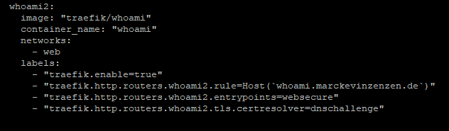

Domain beim Anbieter mieten (z.B. NetCup)
- Cloudflare einrichten
	- Neue Seite hinzufügen
	- Bei Netcup die NS von Cloudflare eintragen
	- 
	- API Token für die neue Domain erweitern (Meiner ist jetzt schon für alle freigegeben)
- Auf dem HM90 im DDClient die Config anpassen
	- 
	- Da hier jetzt nur eine neue Zone hinzugefügt wurde, muss kein neuer Login hinzugefügt werden.
- Auf dem HM90 im Traefik:
	 - keine Anpassungen nötig
 - In einem neuen Container:
	- In einem neuen Container können die Traefik Labels entsprechend benutzt werden
	- 