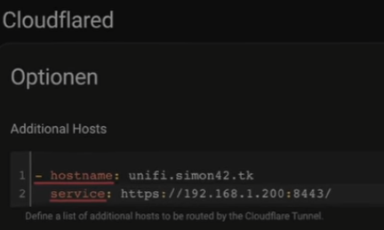

## Home Assistent aus Proxmox in VM installieren
```bash
bash -c "$(wget -qLO - [https://github.com/tteck/Proxmox/raw/main/vm/haos-vm.sh](https://github.com/tteck/Proxmox/raw/main/vm/haos-vm.sh "https://github.com/tteck/Proxmox/raw/main/vm/haos-vm.sh"))"
```

## HomeAssistent von außen erreichbar machen
https://www.youtube.com/watch?v=saqvt9aEQPs

Weitere Services über das Add On freigeben:
einfach in  der Konfiguration folgende Zeile hinzufügen
``` yaml
- hostname: <subdomain>.marckevinzenzen.de
    service: https://<ip>:<port>
```

