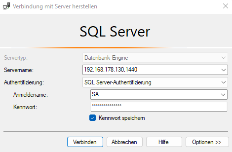

# Hosting an Angular .NET App

Hosting an Angular / .NET App on my homeserver with [Traefik](/traefik) as my reverse proxy.

3 Steps to do:
1. SQL Server
2. .NET Backend
3. Angular Frontend
4. Summary
****
## SQL Server
### Database
``` yml
  sqldb:
    image: mcr.microsoft.com/mssql/server:2019-latest
    user: root
    environment:
      - MSSQL_SA_PASSWORD=SuperSave123!
      - ACCEPT_EULA=Y
    restart: always
    ports:
      - "1440:1433"
    volumes:
      - ./db:/var/opt/mssql
    networks:
      - web
```


### Microsoft SQL Server Management Studio:

- Servername: 192.168.178.130,1440
- Create DB and add tables with the migration functionality


### Problems
**Error:**
```bash
/opt/mssql/bin/sqlservr: Error: The system directory [/.system] could not be created. File: LinuxDirectory.cpp:420 [Status: 0xC0000022 Access Denied errno = 0xD(13) Permission denied]

```

**Solved:**
https://github.com/microsoft/mssql-docker/issues/615
Container must be start as root user! Than the container has the permissions to create the volume. This can be configured in the docker-compose file.
****

## .NET
docker-compose.yml
``` yml
  proverb-backend:
    image: "zenska11/proverb-backend"
    container_name: "proverb-backend"
    restart: always
    depends_on:
      - sqldb
    #ports:
    #  - "5000:80"
    networks:
      - web 
    labels:
      - "traefik.enable=true"
      - "traefik.http.routers.proverbbackend.rule=Host(`proverbbackend.marckevinzenzen.de`)"
      - "traefik.http.routers.proverbbackend.entrypoints=websecure"
      - "traefik.http.routers.proverbbackend.tls.certresolver=dnschallenge"
```
- using the *ports* is only for the local docker image

*contextFactory.cs* needs connectionString from the server DB
*appsettings.json* needs connectionString from the server DB
*appsettings.Development.json* needs connectionString from the server DB

- **Create Dockerfile:**
	1. right click on Presentation Layer 
	2. hinzufügen
	3. Dockerunterstützung
	4. Dockerfile ein Verzeichnis höher ziehen 
		1. Anwendung/Presentation/Dockerfile
		2. Anwendung/Dockerfile
	5. now create docker image and push it to Docker Hub:
``` Docker
docker build -t zenska11/dmz-backend .
docker push zenska11/dmz-backend
```

****

## Angular 
docker-compose.yml
``` yml
services:
  proverb-frontend:
    image: "zenska11/proverb-frontend"
    container_name: "proverb-frontend"
    restart: always
    networks:
      - web
    labels:
      - "traefik.enable=true"
      - "traefik.http.routers.proverbfrontend.rule=Host(`proverb.marckevinzenzen.de`)"
      - "traefik.http.routers.proverbfrontend.entrypoints=websecure"
      - "traefik.http.routers.proverbfrontend.tls.certresolver=dnschallenge"
```
accessible -> proverb.marckevinzenzen.de

#### IDE:
- update Dockerfile:
``` shell
COPY --from=node /app/dist/proverb /usr/share/nginx/html
```

- update environment.prod.ts:
```typescript
export const environment = {
  production: true,
  apiHostname: 'https://dmzbackend.marckevinzenzen.de/api',
};
```

Create Image and push it to Docker Hub:
``` Docker
docker build -t zenska11/dmz-backend .
docker push zenska11/dmz-backend
```
****

## Summary
***docker-compose.yml***
``` yml
version: "3.3"

services:
  proverb-frontend:
    image: "zenska11/proverb-frontend"
    container_name: "proverb-frontend"
    restart: always
    networks:
      - web
    labels:
      - "traefik.enable=true"
      - "traefik.http.routers.proverbfrontend.rule=Host(`proverb.marckevinzenzen.de`)"
      - "traefik.http.routers.proverbfrontend.entrypoints=websecure"
      - "traefik.http.routers.proverbfrontend.tls.certresolver=dnschallenge"

  proverb-backend:
    image: "zenska11/proverb-backend"
    container_name: "proverb-backend"
    restart: always
    depends_on:
      - sqldb
    #ports:
    #  - "5000:80"
    #  - "5001:443"
    networks:
      - web 
    labels:
      - "traefik.enable=true"
      - "traefik.http.routers.proverbbackend.rule=Host(`proverbbackend.marckevinzenzen.de`)"
      - "traefik.http.routers.proverbbackend.entrypoints=websecure"
      - "traefik.http.routers.proverbbackend.tls.certresolver=dnschallenge"
 


  sqldb:
    image: mcr.microsoft.com/mssql/server:2019-latest
    user: root
    environment:
      - MSSQL_SA_PASSWORD=SuperSave123!
      - ACCEPT_EULA=Y
    restart: always
    ports:
      - "1440:1433"
    volumes:
      - ./db:/var/opt/mssql
    networks:
      - web

networks:
  web:
    external: true
```


