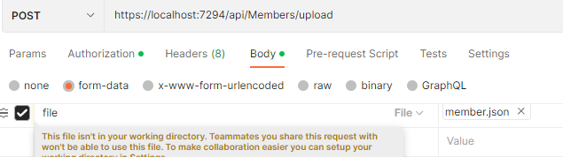
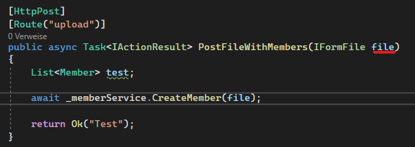

# JSON Convert
Upload file via Postman:
In the POST Request -> Body -> form-data 

its importand, that the key is the same as the parameter in the .NET Core App

## Hilfreiche Links:
[stackoverflow 1](https://stackoverflow.com/questions/40045147/how-to-read-into-memory-the-lines-of-a-text-file-from-an-iformfile-in-asp-net-co)

[stackoverflow 2](https://stackoverflow.com/questions/18192357/deserializing-json-object-array-with-json-net)